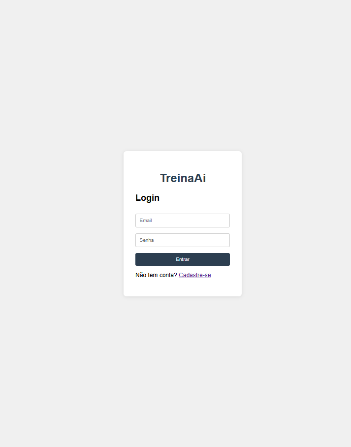
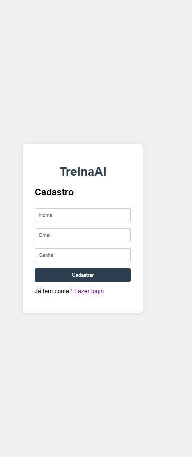
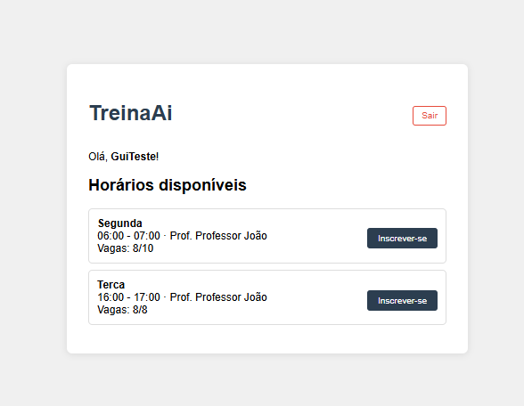
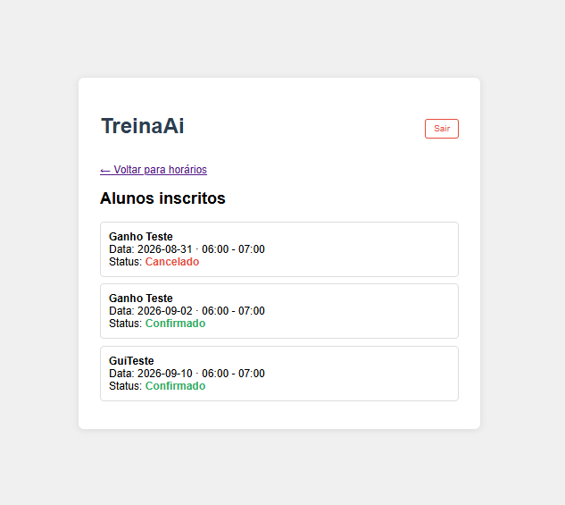

# TreinaAi

Sistema de agendamento de horários de treino para uma academia/personal local.

## Sobre o projeto

Atualmente, a academia organiza os horários de treino da semana enviando uma votação manual pelo WhatsApp, um dia antes, para saber quais alunos vão comparecer em cada horário. O TreinaAi nasceu para substituir esse processo manual por um sistema simples, onde os alunos podem visualizar os horários disponíveis de cada professor (segunda a sexta) e se inscrever diretamente, sem depender de mensagens no grupo.

Este é um projeto pessoal de estudo e portfólio, sem fins comerciais — o objetivo é aprender e construir uma solução real para um problema do dia a dia de um comércio local.

## Funcionalidades

- Cadastro e login de usuários com autenticação JWT
- Visualização dos horários disponíveis por professor, com controle de vagas
- Inscrição e cancelamento em horários de treino
- Painel para professores visualizarem os alunos inscritos em seus horários (incluindo histórico de cancelamentos)
- Restrição de permissões: apenas professores podem criar horários

## Telas

**Login**

**Cadastro**

**Horários disponíveis**

**Painel do professor**

## Tecnologias

**Backend**
- C# / .NET Core
- Entity Framework Core
- PostgreSQL
- ASP.NET Core Identity + JWT (autenticação)
- Swagger (documentação e testes da API)

**Frontend**
- HTML, CSS e JavaScript puro (sem framework)

## Status

Projeto em desenvolvimento ativo. Próximos passos: validações de data no agendamento, tela de "meus agendamentos" para o aluno, e deploy.